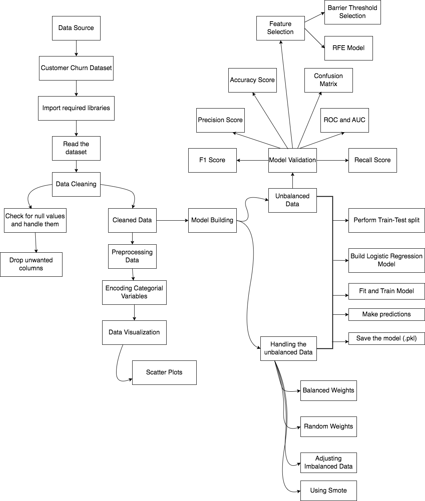

# Predictive Employee Intent Analysis: Identifying Future Job Seekers and Company Devotees using Demographics and Experience Data

## Business Objective
In the realm of Big Data and Data Science, a company specializes in recruiting data scientists from those who successfully complete their training courses. With a large pool of enrolled individuals, the company aims to differentiate candidates who genuinely intend to join their workforce post-training, from those who are actively seeking new job opportunities. This distinction holds the key to reducing costs, enhancing training quality, and optimizing course planning. Leveraging demographic, educational, and experiential data gathered during candidate enrollment, the task at hand is to develop predictive models that ascertain the likelihood of a candidate either seeking alternative employment or committing to the company. This analysis not only informs strategic human resource decisions, but also provides insights into the factors influencing employee decisions concerning their future career paths.

## Architecture Diagram


## Aim

## Approach
- Importing the required libraries and reading the dataset.
- Inspecting and cleaning up the data
- Perform data encoding on categorical variables
- Exploratory Data Analysis (EDA)
  - Data Visualization
- Feature Engineering
  - Dropping of unwanted columns
- Model Building
  - Using the statsmodel library
- Model Building
  - Performing train test split
  - Logistic Regression Model
- Model Validation (predictions)
  - Accuracy score
  - Confusion matrix
  - ROC and AUC
  - Recall score
  - Precision score
  - F1-score
- Handling the unbalanced data
  - With balanced weights
  - Random weights
  - Adjusting imbalanced data
  - Using SMOTE
- Feature Selection
  - Barrier threshold selection
  - RFE method
- Save the model in the form of a pickle file

## Tech Stack
- Language
   - Python
- Libraries
  - numpy, pandas, matplotlib, seaborn, sklearn, pickle, imblearn,
statsmodel 

## Data Description
### Features:
    
## Modular Code Overview

```
  Data
    |_data_regression.csv

  src
    |_Engine.py
    |_ML_pipeline
              |_encoding.py
              |_evaluate_metrics.py
              |_feature_engg.py
              |_imbalanced_data.py
              |_ml_model.py
              |_stats_model.py
              |_rescale_variables.py
              |_scaler.py
              |_train_model.py
              |_utils.py

  lib
    |_logistic_regresion.ipynb

  output
    |_adjusted_model.pkl
    |_balanced_model1.pkl
    |_balanced_model2.pkl
    |_log_ROC.pkl
    |_model_rfe_feat.pkl
    |_model_stats.pkl
    |_model_var_feat.pkl
    |_model1.pkl
    |_smote_model.pkl
```
